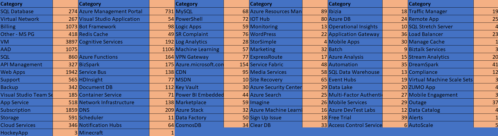
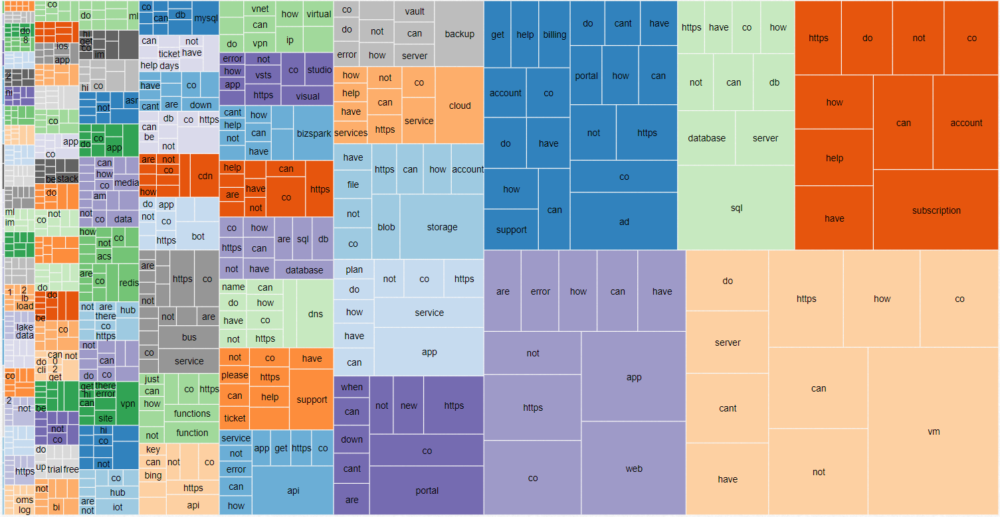
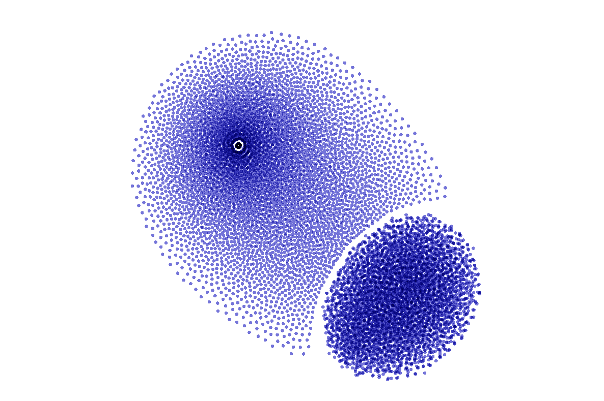

# Machine Learning Engineer Nanodegree
## Capstone Project
Cody Farmer
June 3rd, 2018

## I. Definition
### Project Overview

The goal of this project is to categorize tweets directed at the @AzureSupport handle into the closest Azure service category, such as "Web Applications". This falls into the general *machine learning* tasks called [*Classification*](https://en.wikipedia.org/wiki/Statistical_classification). The field of text classification is one of many *Natural Language Problems* that machine learning has been applied to effectively. After training the network, we will be able to predict the top three categories that an incoming tweet may belong.

 Our solution to this problem will utilize a *convolutional neural network* operating on word vectors created by a pre-trained *word2vec*. *word2vec* provides a method of turning words into arrays that represent various properties of each word. The end result will be the ability to take a tweet and provide the top three categories the network classifies the tweet's subject.

 The task of categorizing natural language applications with a *convolutional neural network* has been explored in a paper by Yoon Kim ^[1]. In her paper, she utilized three towers feeding into a global max pooling layer. This project will follow a similar approach.

### Problem Statement

Twitter has become a popular platform for users to seek help resolving technical issues for users. Although the platform doesn't serve well for troubleshooting, it's vital for any major brand to address these concerns. An integral part of this is sorting the issue into an appropriate category to allow for follow-up from people skilled in those services.

My project will take a single tweet and output the top three matching categories. This will be accomplished using a combination of two techniques, *word2vec* and *convolutional neural networks*. It's also important to properly encode the words before they are input into the model.

First, each tweet is sequenced using the Keras *tokenizer*. This is trained on all of the Tweets previously aimed at Azure. The purpose of the *tokenizer* is to turn words into numbers. It does this through a basic dictionary, resulting in a simple pattern like "Yes" equaling the number 1. Next, these sequences are fed into the *word2vec* network. We will use a pre-trained neural network that was trained by Google using an extremely large corpus (document collection) of text. This is important because classifying a specific set of tweets did not give us a lot of data in the scheme of things - and the pre-trained *word2vec* network helps us mitigate that. 

This *word2vec* network will output a vector representing each word fed into it. This vector attempts to capture the word's relationship to other words in the *corpus*. After feeding a Tweet into the model, we now have multiple vectors that represent each word. We take these vectors and combine them into a matrix - with each row of the matrix being the word vectors created. This will be operated on by a convolutional neural network to make predictions.

This trained model will then be used to predict the category of any given tweet, chosen by the highest probability categories. In order to make the prediction, the tweets will first need to be fed into the *tokenizer* and turned into sequences. A successful prediction will contain the correct category anywhere in the top three, but the training goal will be to make the correct prediction as the highest probability. 

### Metrics
Due to the uneven class distributions in our dataset, the choice of metric is important. Classical accuracy will result in training the network to be accurate only on the more common categories. For this reason, we will be utilizing the *log loss* function, which is in the *Keras* framework as *categorical_crossentropy*. Cross Entropy uses the probability of each category in the dataset to help create a more normalized accuracy metric.'

The *log loss* function is defined as -log P(yt|yp) = -(yt log(yp) + (1 - yt) * log(1 - yp)) where yp is the probability that yt = 1. 

## II. Analysis
### Data Exploration

The dataset to train our neural network consists of 19,258 public tweets for the @AzureSupport twitter handle. These have each been categorized to one of 98 services by trained customer service agents working for Microsoft. The dataset has been provided to me in the CSV format. From this format, I will be tokenizing the tweets using the Keras tokenizer. This will allow me to utilize Gensim to import the word2vec pre-trained embedding weights and transform the tweets into a suitable word 100-dimension vector for training and testing. The dataset also contains other pieces of information, such as a sentiment estimation and followers. This dataset was obtained from Microsoft Support, as they have categorized these tweets already for record keeping. The frequency of the categories can be seen below, with some being extremely underrepresented, redundant, or overly specific.

There are some challenges with learning out of this dataset. First off, the data has a *lexical richness* of .925 - which is incredibly high! This means that the corpus is going to be stretched to it's limit as new Tweets come in, due to the varying word usage present in the dataset.

 As it has been manually categorized and there isn't a clear way to define the right or wrong category, some of the data will not be the "correct" category. It's also not consistently labelled with more than one categories, where some tweets directly belong in multiple. This will make validation a little tricky, as the network may output a better categorization than the actual person. The data will be split with numpy into random sets to create training, validation, and testing sets - 80%, 10%, 10% respectively.

### Exploratory Visualization

The above plot is called a treemap. This treemap demonstrates the frequency of words per each category with the size of each box representing the volume of the word or category. In order to generate the dataset for this visualization, the Natural Language Tool Kit (NLTK) was used to filter out words by part of speech. The parts of speech eliminated to create this graph were pronouns, conjunctions, prepositions, pre-determiners, and interjections. Although these words may be useful for the algorithm's analysis of the Tweets, for visualization it provided the same top words for each category. This is due to some words being very common in questions, like "to" and "why". These words don't really help us visualize the differences in categories.

The bottom-right tan box represents the most common category - VMs. Unsurprisingly, you can see the most common word is "VM". The rest of the common words are still very similar between categories, even with removing the most obvious culprits. This chart demonstrates why this problem can't be solved through more simplistic methods such as word frequency. Some categories - such as billing questions represented in blue - shine in this graph with several different unique words as the most common tweeted. 

### Algorithms and Techniques

The approach for this project, as mentioned above, is to use a Convolutional Neural network to classify tweets. In order to use a CNN, we first need to treat the data properly. These a few notable choices in this task.

**MAX_NB_WORDS** is the total allowed vocabulary size. I have chosen this to be 200,000 - a medium-sized number. The higher the number, the more accuracy you could theoretically have. However, at some point you are incurring a performance penalty for no accuracy gain.

**EMBEDDING_DIMENSIONS** is perhaps the most important constant in our entire program. This determines the length of vectors used to represent our words as word embeddings. Much like the previous constant, the larger the better. You can think of each column in an embedding vector as a feature of the word being vectorized. However, the curse of dimensionality is in effect here. The size of the embedding matrix for us will be [EMBEDDING\_DIMENSIONS, MAX\_NB\_WORDS]. 

**MAX_SEQUENCE_LENGTH** is the maximum length of a sequence that will be output from the input tweet. A _sequence_ is just a numerical representation of words. In our case, we're turning each word of a tweet into a number in our sequence. We've chosen the maximum length to be 50 words. This should encompass almost all tweets, as that would be an average word length of 6 letters to hit the tweet character limit. 

**MIN_SAMPLES** defines the minimum number of samples a category needs to contain in order to train/test on it. This is set to 50 for our purposes. A higher requirement for samples will lead to better accuracy, but can be difficult to obtain. 

These constants are used to prepare the Tweets for processing through the CNN. This CNN is will work on a matrix of the Tweet, instead of the more common method of operating on averages or sums of the _word2vec_ embeddings. As each sequence is fed into the CNN, filters attempt to pick out the most relevant patterns present in the input data. On top of these filters, we create pools to allow the network to detect the pattern in differnt positions within the tweet. This process is the basis for all CNNs. In our network, the _word2vec_ embeddings are fed into four different parallel filters. Each set of filters is individually pooled, then concatenated together. This total array is fed into a dense neural network that is globally averaged together. Then we've created another dense network with a _softmax_ activation. This outputs the likelyhood of each tweet belong to a particular category. 

### Benchmark

In order to establish the effectiveness of my model, I consider two metrics: _Categorical Accuracy_ and _Top 3 Accuracy_. We have available a very good paper to compare against in Yoon Kim's ^[1] work. Our model corresponds closely with what she defines as CNN-static. Her model's accuracy over several different test sets ranges from 81.5% to 93.4% (ignoring SST-1, which I consider an outlier). We will consider our model a success if the _Categorical Accuracy_ surpasses the minimum of those tests - 81.5%.

## III. Methodology
### Data Preprocessing

Our data is provided as large CSV files with classification performed by hand. Along with the category, there are several other fields of information for each Tweet we will train on. These columns aren't of value for us, so I immediately drop them from the dataframe. In addition to removing un-wanted information, Tweets that aren't categorized need to be removed. This can be accomplished by converting the empty fields to NAN values and using the fast dropna method. This accomplished the basic cleaning needed for the data. Next, we perform some actions a little more specific to our particular algorithm.

In order to properly train for a category, we will need enough samples to allow the network to learn patterns. This value is mostly based on experience, and I've set it to 50 as my baseline. The constant can be adjusted, allowing for further tuning. Addtionally, neural networks work best with their targets expressed as integers. We'll accomplish this by _coding_ the categories, using the built-in Pandas method. After coding, each category will have a single corresponding number. For example, 'Active Directory' will be '3'.

Similar to encoding categories to numbers, the input tweets themselves need a representation that is easily understood by the neural networks. This is accomplished by using a _Tokenizer_. Once fit onto a corpus, the _Tokenizer_ will assign a number to each word. This allows us to turn any text into an array of numbers that can be processed by the neural network. Conveniently, Keras included a _Tokenizer_. Our implementation will utilize this Keras function.

### Implementation

In order to perform this classification, I implemented a two-part neural network in Keras. The solution was created and ran inside of a Jupyter Notebook utilizing Tensorflow-GPU. 

The first neural network is a _word2vec_ network that was pre-trained on an extremely large corpus (a set of text). The vectors created from a word2vec network are called _Embeddings_. They are a popular way to represent textual information within machine learning. The created embeddings contain a representation for the word that is learned from the corpus, which can reflect the relationship to other words. In my network, I locked the learned embeddings from being trained. In this case, I'm relying completely on the Google-trained set "GoogleNews-Vectors-negative300". The 300 here is an important value, as it represents the length of each embedding vector. Google provides several embedding vector lengths in pre-trained sets, but any value is possible to use if you train it yourself.

This network has created a mapping of words to embedding vectors, which we then input our entire corpus of text into. In essence, this allows us to represent each word with a 300-length vector. This becomes the first step in our algorithm - take each word from our tweet and represent it as an embedding vector.

Once we've created this vector, we use _Reshape_ to change how we're representing the data. There are various ways to process a sentence after _word2vec_, with the traditional method involving averaging the vector of each word in the sentence. However, we instead transform our embedding vectors into a matrix. Each row of this matrix is one word of the tweet represented as an _embedding vector_. 

This matrix is fed into four separate convolutional towers, each creating filters with different sizes. These filters are each 300 columns with varying number of rows. Each row is representing a word, so you can imagine these filters as covering a different number of words. We used 1, 2, 4, and 5 word filters for each separate tower. Once passed through a filter, the network goes through a _Max Pooling_ to allow for translation of words across the sentence. Additionally, this lowers the computation cost by reducing the number of variables moving forward.

The output of each tower is concatenated together before being fed into another small convolution filter. The output of all of this is put into a _Global Max Pooling_ layer that helps more with translational flexibility and vastly reduces our number of parameters by taking the average of each feature map fed into it.

This network is then fed into a simple fully connected dense layer with 256 nodes. The following layer is a dropout layer to help prevent overfitting to the training dataset. Finally, the network ends with a _softmax_ dense network that outputs the probability for the input to match each category.

### Refinement

The initial pass of the algorithm was surprisingly effective. The first attempt was a sequential network which is much simpler to implement. This was able to predict the category of a tweet with 75% accuracy. However, attempts to increase the accuracy consistently failed. For this reason, the method was switched to a functional multi-column approach. 

In the new architecture, initial training passes have extremely low accuracy. A checkpointer was established with two patiences but the initial couple of training passes never yielded increasing results. The most important breakthrough was to go back to the epoch method and perform a minimum of 10 or more training runs. At two epochs of training, the model yields a lackluster 28% accuracy. However, by epoch 20 we've achieved 92% accuracy.

## IV. Results

### Model Evaluation and Validation

The final model is similar to the initial, with four separate towers containing a _Convolutional_ layer and a _MaxPooling_ layer before being concatenated. Each convolutional layer is fed a matrix from the embedding layer, where each row is a word embedding generated by _word2vec_. 

Each convolutional layer has 512 filters. This value is a balance between effectiveness and resources. The four towers have a different filter size, essentially covering different numbers of words. For our model, these will result in filters of size (300,2), (300,4), (300,5), and (300,1) - representing 2, 4, 5, and 1 word respectively. Each convolutional layer is followed by a max pooling layer of size (10,2) to help generalize the filters. They need to be the same size so we can concatenate them later. 

The output of every tower is concatenated together on the 2nd axis. We then feed this large set of filters into another convolutional layer with 512 filters and a filter size of 1. This layer will give the model the ability to capture larger patterns. This is fed into a 2D Global Max Pooling layer to flatten the model.

This is all fed into a fully connected network of neural nodes, a drop-out layer to help with overfitting, and a final dense layer using _softmax_ activation to produce our probabilities.

The robustness of the network is assisted by the dropout layer, and utilizing a _softmax_ activation layer allows us to provide options other than the best fit. In addition, the training data was split into separate sets so we would not using text or validation data during the training process. This allows us to have confidence that the network will generalize to inputs that were not training upon. 

### Justification

The created model outperformed the earlier benchmark in terms of categorical accuracy, with 92% versus their 81.5%. Additional, when working with the top three values we come out at 97%. When looking to provide users options for category, 97% is definitely high enough. 

## V. Conclusion

## Free-Form Visualization
In this section, you will need to provide some form of visualization that emphasizes an important quality about the project. It is much more free-form, but should reasonably support a significant result or characteristic about the problem that you want to discuss. Questions to ask yourself when writing this section:
- _Have you visualized a relevant or important quality about the problem, dataset, input data, or results?_
- _Is the visualization thoroughly analyzed and discussed?_
- _If a plot is provided, are the axes, title, and datum clearly defined?_

[t-SNE](https://distill.pub/2016/misread-tsne/) is a popular method of visualizing high-dimensionality data. In the above image, we've run t-SNE for 3000 steps at a _perplexity_ of 50. Simulations were also ran at 5 and 10 _perplexity_, which generated a similar output.

This graph is generated from the data in our embedding layer. It really highlights the available groupings in our features. We can see that two clear clusters stand out. These clusters represent how the word embeddings are representing our input text. One cluster is indicative of common, similar terms that are not useful in our understanding of the text. However, the other set of points demonstrate a wide range of possible text while the embeddings accomplish a wide distinct space to make judgements in category.

### Reflection

This project presented a lot of challenges around training and understanding the details of Keras functional networks. The problem space of natural language processing and classification are well studied, helping give me direction in designing the network.

I initially tried a simpler approach of using the sequential network design covered in the curriculum. However, I quickly realized this method would not suffice. My initial network actually produced an accuracy score of ~70%. I was shocked that such a simple network would perform at this rate on the first pass, but I needed to improve it. A few minor tweaks later, and it was consistently performing around 20% accuracy. Basically, the initial result was due to a combination of overfitting and luck with parameter settings.

A large part of the project's time consisted of waiting for training to complete and cleaning the input data. I found the data cleaning to be surprisingly difficult. Although Pandas is very popular, the method for producing output data in the format I required was not immediately obvious to me. After quite a bit of reading and looking at examples, I found the right combination to meet the requirements of both _word2vec_ and my Keras network.

The general design of my network was based off of Yoon Kim's [1] paper, but I found it rather spare in details. I was surprised to see almost nothing about how the format for the input data was created, or details around the layers utilized. The general terms in the paper left me with a lot of exploration on my own. This also forced me to work on my own understanding of what type of layers to use, such as _GlobalMaxPooling_ or _GlobalAvgPooling_.

Overall, I greatly enjoyed working in the project. The relative ease of creating such an accurate model within Keras is shocking, and not something I would have considered ever being able to do before taking the course. It also reinforced just how much time training can take! The final model takes about 6 minutes per epoch. I was constantly lowering my filter numbers and trying larger pooling layers to help with both training time and VRAM. The idea of doing this on a CPU would be mind blowing, as it would take forever to do a single epoch! Additionally, it helps put into perspective how offerings such as Azure's HDInsight clusters are so desirable for machine learning. The ability to spin up a machine that crunches through a gigantic model within an hour or two is definitely tempting.

All said and done, I'm extremely happy with how the model performed. CNNs are the staple for solving Natural Language Problems moving forward, and this particular model is nice as it allows me to create an API to return the analysis from the trained model extremely quickly.

### Improvement
In this section, you will need to provide discussion as to how one aspect of the implementation you designed could be improved. As an example, consider ways your implementation can be made more general, and what would need to be modified. You do not need to make this improvement, but the potential solutions resulting from these changes are considered and compared/contrasted to your current solution. Questions to ask yourself when writing this section:
- _Are there further improvements that could be made on the algorithms or techniques you used in this project?_
- _Were there algorithms or techniques you researched that you did not know how to implement, but would consider using if you knew how?_
- _If you used your final solution as the new benchmark, do you think an even better solution exists?_

The first improvement that comes to mind is around the _Word Embeddings_. There are several options for different types of _Word Embeddings_, including a newer popular FastText. I did not spend my time experimenting for which ones produced the best result. In addition, I can train my own instead of using the pre-created values. It's important that I use an extremely large corpus when training a _Word Embedding_ network, so I did not do it in this project. With either more data - or just scraping general data from Twitter - I can train my own more accurate embeddings. I think this space is where the most improvement can be made.

I think a better solution can be achieved as far as the top three, but it would be a difficult task with already such a high matching percent. 

[1] Kim, Yoon https://arxiv.org/pdf/1408.5882.pdf