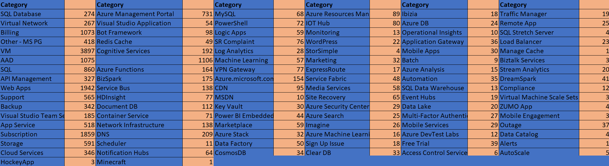

# Machine Learning Engineer Nanodegree
## Capstone Proposal
Cody Farmer
November 20, 2017

## Proposal

### Domain Background

Natural Language Processing (henceforth referred to as NLP) is an exciting field that has been progressing rapidly since computing power for Machine Learning became generally available in the 1980s. The ability to allow for natural human interaction with machines is an important feature in many aspects of technology. Decision trees were originally employed to handle this, where a hard set of yes/no branches would result in a prediction. This technique could be viewed as a bunch of attempts at disambiguation to classify each word. This introduced many problems with having to define a formal grammar for human speech, which is extremely brittle[1](https://dl.acm.org/citation.cfm?id=192779). Eventually, a statistical approach was adopted which allowed for some exciting research in NLP[2](http://www.aclweb.org/anthology/W09-0103). 

The popularity of deep learning has led to some state-of-the-art techniques in various NLP tasks. One big leap forward has been using word embeddings[3](https://arxiv.org/pdf/1310.4546.pdf) to represent text, instead of a sparse vector which was a 1-to-1 mapping of vocabulary. In addition to the gains in reducing dimensionality with this method, another large benefit is having pre-trained sets available. For the example of *word2vec*, the embeddings are publically available that are trained on millions of webpages including Wikipedia. This gives a great opportunity for transfer learning, which will be utilized in this project. 

### Problem Statement

This project will set out to solve a *text classification* problem. The classification will be performed on tweets. The goal is to provide the correct category in the top 3, 99% of the time. The tweets analyzed are all directed at @azuresupport, which provides some information in itself. This work can also be extended to a wider range of tweets, to classify them as relevant even if they're not directed to this particular channel. Using *word2vec's* pre-trained model in addition to a neural network trained on a small labelled dataset will result in a classification of each tweet's category to match one of the 39 categories chosen. 

### Datasets and Inputs

The dataset to train our neural network consists of 19,258 public tweets for the @AzureSupport twitter handle. These have each been categorized to one of 98 services by trained customer service agents working for Microsoft. The dataset has been provided to me in the CSV format. From this format, I will be tokenizing the tweets using the Keras tokenizer. This will allow me to utilize Gensim to import the word2vec pre-trained embedding weights and transform the tweets into a suitable word 100-dimension vector for training and testing. The dataset also contains other pieces of information, such as a sentiment estimation and followers. This dataset was obtained from Microsoft Support, as they have categorized these tweets already for record keeping. The frequency of the categories can be seen below, with some being extremely underrepresented, redundant, or overly specific. 

There are some challenges with learning out of this dataset. As it has been manually categorized and there isn't a clear way to define the right or wrong category, some of the data will not be the "correct" category. It's also not consistently labelled with more than one categories, where some tweets directly belong in multiple. This will make validation a little tricky, as the network may output a better categorization than the actual person. The data will be split with numpy into random sets to create training, validation, and testing sets - 80%, 10%, 10% respectively. 

### Solution Statement

I will create a convolutional neural network (CNN) on top of a word embedding with pre-trained weights from Word2Vec in Keras. This network will accept the entire tweet as an input, and determine the classification of the tweet into one of the categories defined in the training set. Categories with less than five data points will be eliminated from contention. The network will end in a softmax layer which will output the likelyhood of each category. The top three most probable categories will be passed as solutions.

### Benchmark Model

This project will coincide well with work by [Yoon Kim](http://www.aclweb.org/anthology/D14-1181)4 using a neural network on top of a word embedding. Kim also used word2vec, and tested the algorithm on several different common NLP problems. The most similar problem tested on is the [TREC](http://trec.nist.gov/) dataset, which is the classification of questions into six different types.  

The network created for this problem will resemble the CNN-Static modle from Kim the most. For this reason, we will use their results with this architecture as the benchmark for our own model. Below, you can see the accuracy of each model for the problems tackled. 

### Evaluation Metrics

Due to the uneven class distributions in our dataset, the choice of metric is important. Classical accuracy will result in training the network to be accurate only on the more common categories. For this reason, we will be utilizing the *log loss* function, which is in the *Keras* framework as *categorical_crossentropy*. Cross Entropy uses the probability of each category in the dataset to help create a more normalized accuracy metric.

### Project Design

In the social media space, there is a wealth of text information. Although the sheer volume can create a difficult situation in communicating to your customers through this medium, companies still feel the need to engage. The easiest method is simply to monitor a Twitter handle for customers messaging directly. However, the scale of messages will quickly overwhelm even large teams. Classically, in customer relations you want to categorize these incoming messages before handing them off to the correct people.

This task is called *text classification* and has been a popular area of study for many years. There are many approaches to text classification[5](https://pdfs.semanticscholar.org/ca35/6b3d49ff88ac29abf14afbd78b241b1c4439.pdf) with great strides coming with various machine learning techniques. SVMs have long been an extremely effective method of accomplishing *text classification*. The latest techniques are now using ensembles methods with SVM and advanced learning techniques like AIS (Artificial Immune Systems) to achieve state of the art results[6](https://link.springer.com/chapter/10.1007/978-3-642-20267-4_36). Varying algorithms perform extremely well in text classification tasks, depending on many features of the exact data. This can make the ideal approach difficult to ascertain. Machine Learning; however, has always been about implementation and testing. Building a CNN on top of word embeddings has proven to be effective enough to satisfy the required metrics in general and will be the method I use to solve this problem.

Once I've decided on the general approach to use - a neural network with word embeddings - I will still need to decide on the structure of the network. In Yoon Kim's paper, a fairly straight forward neural network was implemented. A word embeddings layer fed into several convolutional layers, followed by a pooling layer. This layer then fed into dense layers that contained dropout layers with a soft-max activation at the endpoints to provide the network's outputs. I see very little reason to alter this method drastically for my task, but there are a few important characteristics of the dataset provided that will feed into the design of the neural network. 

The dataset was obtained by agents manually categorizing each tweet into the one they believed was the best fit. This will allow some bias to seep in - agents are more likely to categorize things into more familiar categories. However, there is no harm in our network learning this same bias. 

The dataset has some under represented categories, as can be seen in Figure 1 above. For the categories that are less than 5 instances, we will remove them from consideration. Since this dataset is taken over two years, it's reasonable to assume that they are not going to be common enough to affect our error rate if they are only seen a few times over two years! This will allow us to reduce the output space a bit, helping with the growing complexity of determining so many different categories. 

With the inconsistent data categories representation, it's also important that the network has a strong dropout layer. This layer - which removes a random portion of the neural nodes - will help reduce overfitting. Simply speaking, the dropout layer will help make sure the data is generalized a bit more instead of only looking for the exact same tweets as the input for each category. 

This network will be trained on categorized tweets from the last two years by splitting the tweets into training, validation, and testing sets. Once trained, new incoming tweets will be fed into the network and the top three likely categories will be output. This training will produce weights for each of the neural network's nodes, and these weights will be remembered moving forward. Using this trained network, we can make predictions based off of new inputs as they come in by feeding them back into the network. This process is quick, as all of the heavy computation has been done up-front in the training stage. The agent will will then be able to choose the correct category for labelling. This is a much easier task than presenting 90+ categories for the agent to choose their category from, while similarily reducing the workload. 

As time goes on, additional categories will almost certainly need to be added. In this use case - Azure - there are constantly new services being rolled out. On top of brand new categories, the use of this automated system will increase the number of samples to learn off of. Due to this, it will be natural to re-evaluate the model after a few months to add additional samples. A method for providing the agent's own category instead of one of the top3 will allow issues of inaccuracy to become apparent and be resolved. 

-----------
### References
1. David Mitchell Magerman. 1994. Natural Language Parsing as Statistical Pattern Recognition. Ph.D. Dissertation. Stanford University, Stanford, CA, USA. UMI Order No. GAX94-22102. 

2. Mark Johnson. 2009. How the statistical revolution changes (computational) linguistics. In Proceedings of the EACL 2009 Workshop on the Interaction between Linguistics and Computational Linguistics: Virtuous, Vicious or Vacuous? (ILCL '09). Association for Computational Linguistics, Stroudsburg, PA, USA, 3-11. 

3. Tomas Mikolov, Ilya Sutskever, Kai Chen, Greg Corrado, and Jeffrey Dean. 2013. Distributed representations of words and phrases and their compositionality. In Proceedings of the 26th International Conference on Neural Information Processing Systems - Volume 2 (NIPS'13), C. J. C. Burges, L. Bottou, M. Welling, Z. Ghahramani, and K. Q. Weinberger (Eds.), Vol. 2. Curran Associates Inc., USA, 3111-3119. 

4. Yoon Kim. 2014. Convolutional Neural Networks for Sentence Classification. arXiv:1408.5882v2 

5. Durga Bhavani Dasari and Venu Gopala Rao. 2012. Text Categorization and Machine Learning Methods: Current State of the Art. Global Journal of Computer Science and Technology Software & Data Engineering Volume 12 Issue 11 Version 1.0 Year 2012. Global Journals Inc., USA, 0975-4172.

6. Mario Antunes, Silva Catarina, Bernardete Ribeiro, and Manuel Correia. 2011. A Hybrid AIS-SVM Ensemble Approach for Text Classification. Adaptive and Natural Computing Algorithms: 10th International Conference, ICANNGA 2011, Ljubljana, Slovenia, April 14-16, 2011, Proceedings, Part II. Springer Berlin Heidelberg, Berlin, Heidelberg. 342-352.

